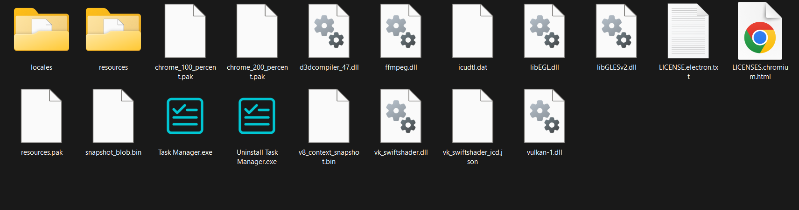

# Task Manager App - Electron

A modern, feature-rich desktop task management application built with Electron, featuring comprehensive task organization, productivity tracking, and focus tools.

## 📱 Screenshots

<table>
  <tr>
    <td width="50%">
      <h3>📋 Task Management</h3>
      
      <p><em>Create, edit, and manage tasks with priority levels, due dates, and real-time search</em></p>
    </td>
    <td width="50%">
      <h3>✅ Completed Tasks</h3>
      
      <p><em>Track accomplishments with golden-themed completed tasks section</em></p>
    </td>
  </tr>
  <tr>
    <td width="50%">
      <h3>📊 Statistics & Analytics</h3>
      
      <p><em>Monitor productivity with detailed charts and comprehensive analytics</em></p>
    </td>
    <td width="50%">
      <h3>⏰ Focus & Productivity</h3>
      
      <p><em>Stay productive with Pomodoro timer, break timer, and stopwatch tools</em></p>
    </td>
  </tr>
  <tr>
    <td colspan="2" align="center">
      <h3>📁 Application Structure</h3>
      
      <p><em>Clean, organized project structure with modern development practices and comprehensive documentation</em></p>
    </td>
  </tr>
</table>

## 🚀 Features

### 📋 Task Management
- **Create & Edit Tasks**: Add tasks with titles, descriptions, due dates, and priority levels
- **Built-in Timers**: Individual task timers with preset durations (15m, 30m, 45m, 1h, 2h, 3h) and custom settings
- **Timer Controls**: Start, pause, reset timers with visual progress tracking
- **Dual Completion**: Complete tasks manually or automatically when timer reaches zero
- **Priority System**: Organize with Low, Medium, High priority levels and color-coded filters
- **Smart Search**: Real-time search across titles, descriptions, dates, and priorities
- **Bulk Operations**: Delete all tasks or completed tasks with single actions

### ✅ Completed Tasks
- **Golden Theme**: Distinctive visual design with dedicated search functionality
- **Completion Tracking**: View all completed tasks with timestamps
- **Duplicate Prevention**: Smart system prevents duplicate entries
- **Bulk Management**: Delete all completed tasks at once

### 📊 Statistics & Analytics
- **Interactive Charts**: Visual productivity data powered by Chart.js
- **Time Tracking**: Detailed insights into time spent on tasks and timer usage
- **Streak Tracking**: Monitor consecutive days of task completion
- **Category Analysis**: Task distribution and weekly productivity patterns

### ⏰ Focus & Productivity Tools
- **Pomodoro Timer**: Built-in focus timer with customizable work/break intervals
- **Break Timer & Stopwatch**: Dedicated tools for breaks and general timing
- **Timer Persistence**: All timer states and progress persist across app sessions

### 🎨 User Interface
- **Modern Design**: Clean, dark theme with accent colors
- **Responsive Layout**: Adaptable interface that works across different screen sizes
- **Smooth Animations**: Polished transitions and hover effects
- **Intuitive Navigation**: Easy-to-use sidebar navigation
- **Search Integration**: Dedicated search bars with color-coded themes

## 🛠️ Technologies Used

- **Frontend**: HTML, CSS, Vanilla JavaScript
- **Desktop Framework**: Electron
- **Data Visualization**: Chart.js
- **Icons**: Lucide Icons
- **Build Tool**: Electron Builder

## 📦 Installation

### Option 1: Download Pre-built Executable (Recommended)

**For Windows Users:**
1. Download the latest release: **[Task Manager Setup 2.0.2.exe](https://github.com/KareemH-1/Task-Manager-App-Electron/blob/main/Task%20Manager%20Setup%202.0.2.exe)**
2. Run the installer
3. Launch the Task Manager from your desktop or start menu

### Option 2: Build from Source

#### Prerequisites
- Node.js (v14 or higher)
- npm or yarn


### Building for Distribution

To create a distributable version:

```bash
npm run dist
```

This will create platform-specific installers in the `dist/` directory.

## 🚀 Usage

### Getting Started
1. Launch the application
2. Create tasks using the sidebar form with priority levels and due dates
3. Set timers using preset buttons (15m, 30m, 45m, 1h, 2h, 3h) or custom duration
4. Use timer controls to start/pause and track progress
5. Navigate between sections: Tasks, Completed, Statistics, Focus

### Key Operations
- **Task Management**: Add, edit, complete tasks manually or via timer
- **Search & Filter**: Use real-time search and priority filters
- **Productivity Tools**: Access Pomodoro timer and analytics in dedicated sections

## 🎯 Key Features in Detail

### Search & Organization
- **Smart Search**: Real-time filtering across all task properties
- **Priority System**: Color-coded levels (Low/Medium/High) with dedicated filters
- **Dual Themes**: Teal for active tasks, golden for completed tasks

### Data Management
- **Local Storage**: Electron Store for reliable data persistence
- **Session Recovery**: Resume with all timers and progress intact
- **Automatic Saving**: Real-time data sync with duplicate prevention

## 📱 Platform Support

- ✅ Windows (Primary)
- ✅ macOS (Supported)
- ✅ Linux (Supported)

## 🤝 Contributing

Contributions are welcome! Please feel free to submit a Pull Request.

### Development Setup
1. Fork the repository
2. Create a feature branch (`git checkout -b feature/AmazingFeature`)
3. Commit your changes (`git commit -m 'Add some AmazingFeature'`)
4. Push to the branch (`git push origin feature/AmazingFeature`)
5. Open a Pull Request


## 👨‍💻 Author

**KareemH-1**
- GitHub: [@KareemH-1](https://github.com/KareemH-1)

## 🐛 Bug Reports & Feature Requests

Please use the GitHub Issues tab to report bugs or request features.

**Made with ❤️ using Electron**
