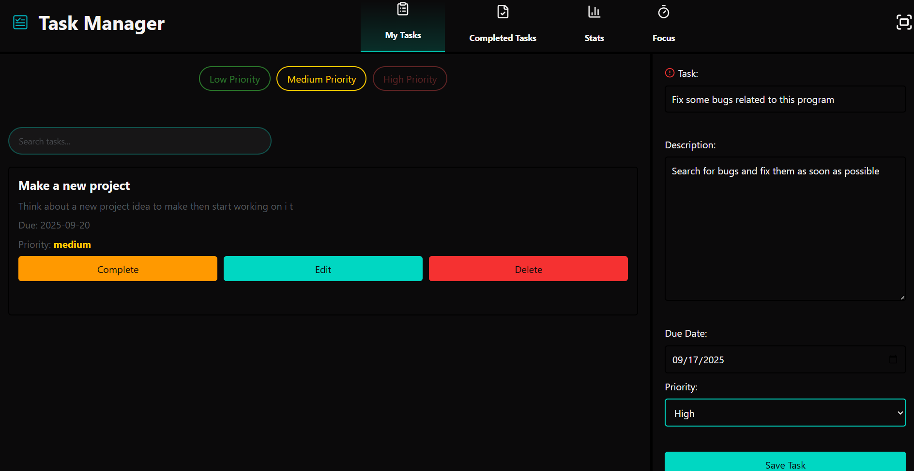
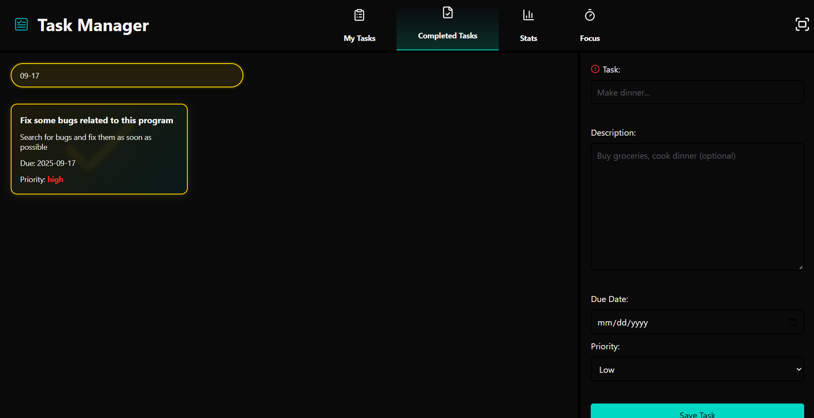
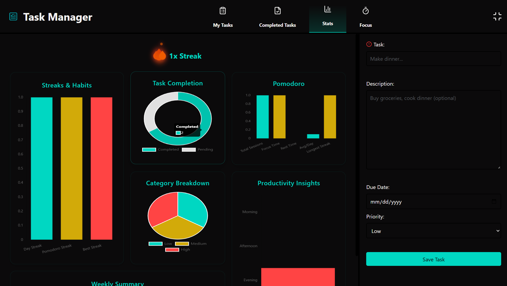
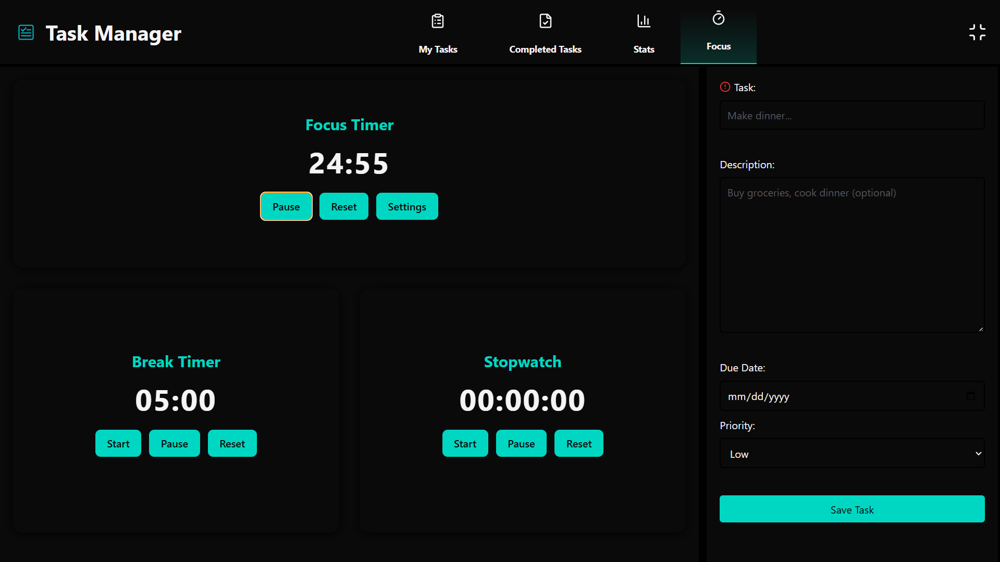

# Task Manager App - Electron

A modern, feature-rich desktop task management application built with Electron, featuring comprehensive task organization, productivity tracking, and focus tools.

## � Screenshots

<table>
  <tr>
    <td width="50%">
      <h3>📋 Task Management</h3>
      
      <p><em>Create, edit, and manage tasks with priority levels, due dates, and real-time search</em></p>
    </td>
    <td width="50%">
      <h3>✅ Completed Tasks</h3>
      
      <p><em>Track accomplishments with golden-themed completed tasks section</em></p>
    </td>
  </tr>
  <tr>
    <td width="50%">
      <h3>📊 Statistics & Analytics</h3>
      
      <p><em>Monitor productivity with detailed charts and comprehensive analytics</em></p>
    </td>
    <td width="50%">
      <h3>⏰ Focus & Productivity</h3>
      
      <p><em>Stay productive with Pomodoro timer, break timer, and stopwatch tools</em></p>
    </td>
  </tr>
</table>

## �🚀 Features

### 📋 Task Management
- **Create & Edit Tasks**: Add tasks with titles, descriptions, due dates, and priority levels
- **Priority System**: Organize tasks with Low, Medium, and High priority levels
- **Task Completion**: Mark tasks as complete with visual feedback
- **Smart Search**: Real-time search functionality for both active and completed tasks
- **Priority Filters**: Filter tasks by priority level for better organization
- **Bulk Operations**: Delete all tasks with a single action

### ✅ Completed Tasks
- **Completion Tracking**: View all completed tasks in a dedicated section
- **Golden Theme**: Completed tasks feature a distinctive golden color scheme
- **Search & Filter**: Dedicated search functionality for completed tasks
- **Visual Indicators**: Clear visual distinction between active and completed items

### 📊 Statistics & Analytics
- **Comprehensive Charts**: Visual representation of task completion and productivity
- **Streak Tracking**: Monitor consecutive days of task completion
- **Category Breakdown**: Analyze task distribution across different categories
- **Weekly Summary**: Track weekly productivity patterns
- **Productivity Insights**: Detailed analytics for performance optimization

### ⏰ Focus & Productivity Tools
- **Pomodoro Timer**: Built-in focus timer with customizable work/break intervals
- **Break Timer**: Dedicated break timer for proper rest periods
- **Stopwatch**: General-purpose timing tool
- **Custom Settings**: Adjustable timer durations to fit your workflow
- **Session Tracking**: Record and analyze focus sessions

### 🎨 User Interface
- **Modern Design**: Clean, dark theme with accent colors
- **Responsive Layout**: Adaptable interface that works across different screen sizes
- **Smooth Animations**: Polished transitions and hover effects
- **Intuitive Navigation**: Easy-to-use sidebar navigation
- **Search Integration**: Dedicated search bars with color-coded themes

## 🛠️ Technologies Used

- **Frontend**: HTML, CSS, Vanilla JavaScript
- **Desktop Framework**: Electron
- **Data Visualization**: Chart.js
- **Icons**: Lucide Icons
- **Build Tool**: Electron Builder

## 📦 Installation

### Option 1: Download Pre-built Executable (Recommended)

**For Windows Users:**
1. Download the latest release: **[Task Manager Setup 1.0.0.exe](https://github.com/KareemH-1/Task-Manager-App-Electron/releases/download/v1.0.0/Task%20Manager%20Setup%201.0.0.exe)**
2. Run the installer
3. Launch the Task Manager from your desktop or start menu

### Option 2: Build from Source

#### Prerequisites
- Node.js (v14 or higher)
- npm or yarn


### Building for Distribution

To create a distributable version:

```bash
npm run dist
```

This will create platform-specific installers in the `dist/` directory.

## 🚀 Usage

### Getting Started
1. Launch the application
2. Use the sidebar to navigate between different sections
3. Create your first task using the form in the sidebar
4. Set priority levels and due dates as needed

### Task Management
- **Adding Tasks**: Fill out the form with task details and click "Save Task"
- **Editing Tasks**: Click the edit button on any task item
- **Completing Tasks**: Click the "Complete" button to mark tasks as done
- **Searching**: Use the search bars to quickly find specific tasks
- **Filtering**: Use priority filters to focus on specific task types

### Productivity Features
- **Focus Timer**: Navigate to the Focus section to use the Pomodoro timer
- **Statistics**: Check the Stats section for detailed productivity analytics
- **Completed Tasks**: Review your accomplishments in the Completed Tasks section

## 🎯 Key Features in Detail

### Search Functionality
- **Active Tasks**: Teal-colored search bar with accent color theming
- **Completed Tasks**: Golden search bar matching completed task styling
- **Real-time Filtering**: Instant results as you type
- **Comprehensive Search**: Searches through titles, descriptions, due dates, and priorities

### Priority System
- **Visual Coding**: Color-coded priority levels for quick identification
- **Filter Options**: Dedicated buttons to filter by priority level
- **Smart Organization**: Higher priority tasks get visual emphasis

### Data Persistence
- **Local Storage**: All data is stored locally using Electron Store
- **Automatic Saving**: Changes are saved automatically
- **Data Integrity**: Robust data handling prevents loss of information

## 🔧 Configuration

The application uses Electron Store for configuration and data persistence. Settings are automatically saved and restored between sessions.

### Customizable Settings
- Focus timer duration
- Break timer duration
- Theme preferences (future enhancement)

## 📱 Platform Support

- ✅ Windows (Primary)
- ✅ macOS (Supported)
- ✅ Linux (Supported)

## 🤝 Contributing

Contributions are welcome! Please feel free to submit a Pull Request.

### Development Setup
1. Fork the repository
2. Create a feature branch (`git checkout -b feature/AmazingFeature`)
3. Commit your changes (`git commit -m 'Add some AmazingFeature'`)
4. Push to the branch (`git push origin feature/AmazingFeature`)
5. Open a Pull Request


## 👨‍💻 Author

**KareemH-1**
- GitHub: [@KareemH-1](https://github.com/KareemH-1)

## 🐛 Bug Reports & Feature Requests

Please use the GitHub Issues tab to report bugs or request features.

**Made with ❤️ using Electron**
